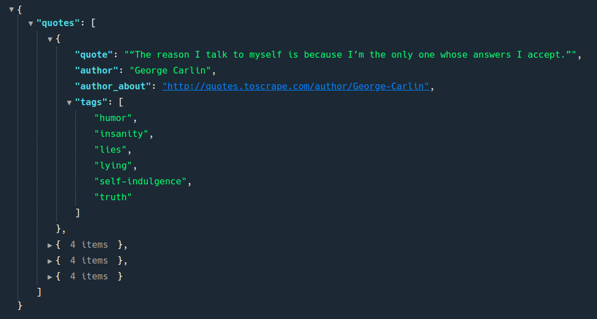

# Desafio Inovamind



### **Desafio:** 

Crie um web crawler para efetuar uma busca de frases no site http://quotes.toscrape.com/.
As infomações vindas do crawler devem ser disponibilizadas por uma API. Esta API deve receber como
parâmetro uma tag e buscar por frases que estejam classificadas de acordo com esta tag.
As informações extraidas do site devem ser salvas no MongoDB que simulará um cache, onde caso a tag já
tenha sido pesquisada, deverá retornar os dados persistidos previamente no banco de dados.

Ferramentas utilizadas:

* Ruby: 2.6.0

* Rails: 6.0.3

* Mongoid: 7.0.5

* Active Model Serializers: 0.10.10

* Services ( CrawlerService )


Endpoints:

* Buscar os quotes por tags:

```json
# GET /quotes/:search_tag

{ 
  "quotes": [
      {
        "quote" : "String: Aprender nunca será demais",
        "auhtor": "String: Alef O. de Oliveira",
        "author_about": "String: Programador Entusiasta",
        "tags": [":search_tag: ['learn','life', 'live']"]
      }
  ]
}
```

* Buscar todos os quotes:

```json
# GET /quotes

{ 
  "quotes": [
      {
        "quote" : "String: Sempre em busca do melhor",
        "auhtor": "String: Alef O. de Oliveira",
        "author_about": "String: Programador Entusiasta",
        "tags": [":search_tag: ['learn','life', 'live']"]
      }
  ]
}
```


* Service criado para buscar os quotes do site mencionado no desafio:

```ruby
require 'nokogiri'
require 'open-uri'

class CrawlerService
  attr_accessor :quotes,:search
  def initialize(search)
    @search = search
    @quotes = []
  end

  def scrape_page(url)
    Nokogiri::HTML(URI.open(url))
  end

  def perform
    begin
      doc = scrape_page("http://quotes.toscrape.com/tag/#{@search}/")

      quotes = doc.css('div.quote')

      quotes.each do |quote|
        title  = quote.css('span.text').text
        author = quote.css('span small.author').text
        about  = "http://quotes.toscrape.com#{quote.css('span a').attribute('href').value}"
        tags   = quote.css('div.tags meta.keywords').attribute('content').value.split(',')
        @quotes << {quote: title, author: author, author_about: about, tags: tags}
      end

      @quotes
    rescue StandardError => e
      puts e
    end
  end

  
end
```

* **Deploy da API:** on Heroku [API](http://site.com)

*Muito obrigado pela oportunidade de participar desse desafio, em cada desafio sempre um novo aprendizado, e aprender nunca será demais !*


**Facebook:** [Alef Ojeda de Oliveira](https://www.facebook.com/AlefOjedaOliveira)

**Linkedin:** [Alef Ojeda de Oliveira](https://www.linkedin.com/in/alef-ojeda/)

**Email:** [Alef Ojeda de Oliveira](mailto:nemubatubag@gmail.com)